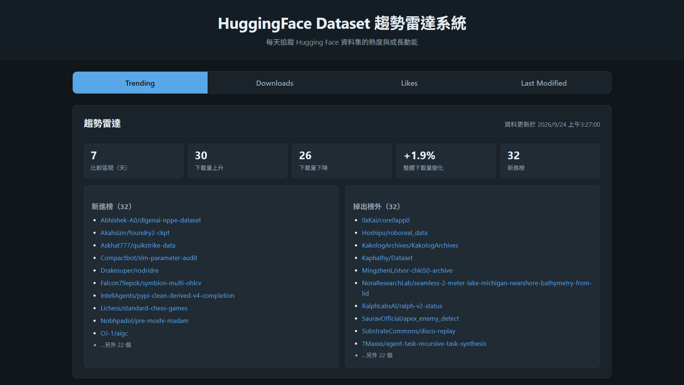
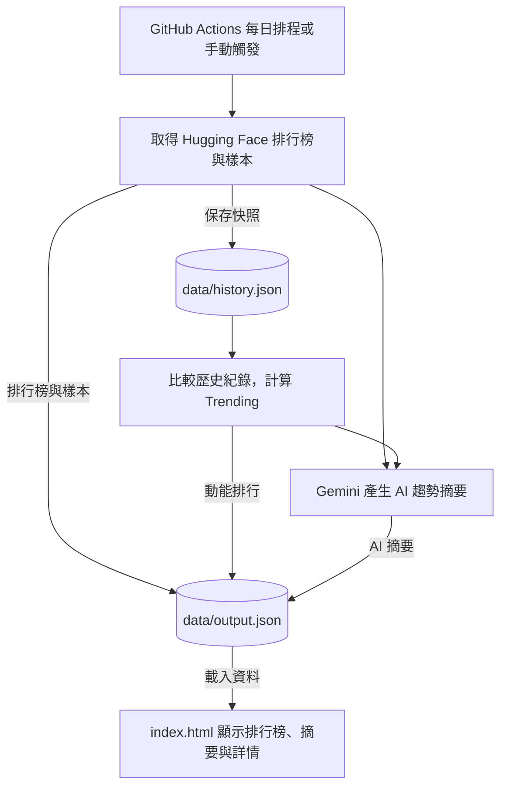

# HF-TrendRadar｜Hugging Face 資料集趨勢雷達

看看 Hugging Face 上哪些資料集最受歡迎、哪些近期熱度正在上升。HF-TrendRadar 整理熱門排行與近期變化，搭配 AI 摘要，幫助你找到值得關注的資料集。

**[開啟 HF-TrendRadar →](https://yesaouo.github.io/HF-TrendRadar/)**

開啟網站即可瀏覽，不需安裝程式或提供 API Key。

## ✨ 功能

- **熱門與近期更新排行** — 查看下載量最高（Downloads）、按讚數最多（Likes）與最近更新（Last Modified）的資料集，各列出前 30 名。
- **Trending 動能排行** — 比較資料集近期下載量的成長幅度，找出熱度上升的資料集，並追蹤榜單進出與按讚數變化。
- **AI 趨勢摘要** — 由 Gemini 整理三種排行榜的主要領域、資料類型與研究建議；有可用的趨勢資料時，也會加入成長動能分析。
- **搜尋與篩選** — 用資料集 ID、作者或描述搜尋，搭配文字、圖片、音訊等模態標籤篩選，也能依下載量、按讚數、更新時間或名稱排序。
- **資料集詳情與樣本** — 點選卡片，查看描述、標籤、時間與 Hugging Face 原始連結。有可用樣本時，也能預覽圖片、影片與其他欄位。
- **複製提示詞** — 一鍵複製包含授權、任務、模態、規模與描述的資料集資訊，方便貼到 AI 對話中繼續提問。
- **深色模式與鍵盤操作** — 跟隨系統切換配色，支援鍵盤操作與 Esc 關閉詳情。

## 📈 如何看懂 Trending

Trending 追蹤上述三種排行榜中的資料集，並與約一週前的紀錄比較，依下載量成長百分比排序。榜單僅顯示近 30 天下載量至少 1,000 次，且下載量持續成長的資料集。

**下載量是近 30 天的統計值，而非歷史累計量。** 因此，Trending 顯示的是近期下載活躍度的變化，而不是比較期間內新增的下載次數。

「新進榜」表示資料集出現在本次追蹤榜單中，但未出現在比較用的歷史紀錄中；「掉出榜外」則相反。這不代表資料集剛發布或已被刪除。

## 🕒 更新時間

系統排定每天台北時間 00:00 擷取資料，實際更新時間請以頁面標示為準。AI 摘要會另外標示產生時間；若生成失敗，會保留並註明沿用前一次的摘要。

## 🏗️ 專案結構

| 檔案 | 用途 |
|---|---|
| `hf_scraper.py` | 取得 Hugging Face 排行榜、資料集資訊與可用樣本。 |
| `trend_history.py` | 保存歷史紀錄，比較資料集的成長幅度與榜單變化。 |
| `ai_dataset_digest.py` | 使用 Gemini 產生各榜單的趨勢摘要。 |
| `main.py` | 執行資料更新流程，整合排行榜、趨勢與摘要。 |
| `index.html` | 呈現排行榜、AI 摘要與資料集詳情。 |

## 🛠️ 技術堆疊

*   **資料處理**：Python
*   **前端**：原生 HTML / CSS / JavaScript
*   **AI 摘要**：Google Gemini
*   **自動化與部署**：GitHub Actions + GitHub Pages

## 📄 授權

本專案採用 [MIT License](LICENSE) 授權。
